# RishiPath POS - System Flowcharts

> **Visual guide to every business process in the system**

---

## Table of Contents

1. [Complete System Overview](#1-complete-system-overview)
2. [Store Setup Flow](#2-store-setup-flow)
3. [Product Catalog Flow](#3-product-catalog-flow)
4. [Purchase & Receiving Flow](#4-purchase--receiving-flow)
5. [Inventory Management Flow](#5-inventory-management-flow)
6. [Point of Sale (POS) Flow](#6-point-of-sale-pos-flow)
7. [Customer & Loyalty Flow](#7-customer--loyalty-flow)
8. [Supplier & Payment Flow](#8-supplier--payment-flow)
9. [Reporting & Analytics Flow](#9-reporting--analytics-flow)
10. [Multi-Store Operations Flow](#10-multi-store-operations-flow)
11. [B2B / Wholesale Flow](#11-b2b--wholesale-flow)
12. [Complete Business Lifecycle](#12-complete-business-lifecycle)

---

## 1. Complete System Overview

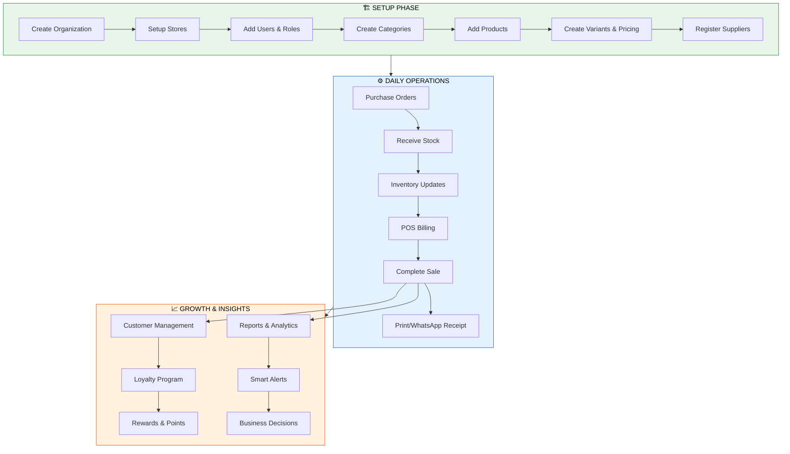

---

## 2. Store Setup Flow

> **One-time setup to get your business running on RishiPath**

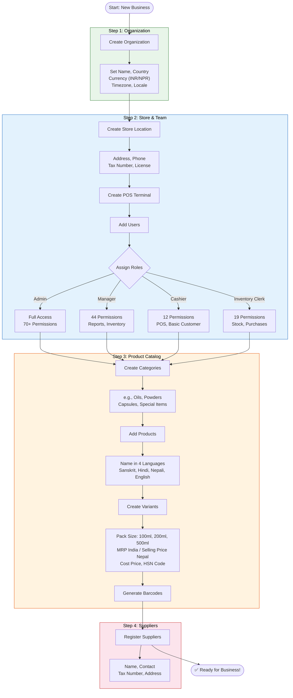

---

## 3. Product Catalog Flow

> **How products are structured in the system**

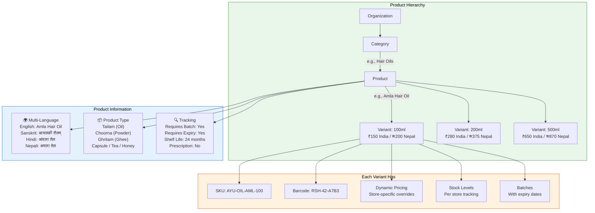

---

## 4. Purchase & Receiving Flow

> **From placing an order to stock on the shelf**

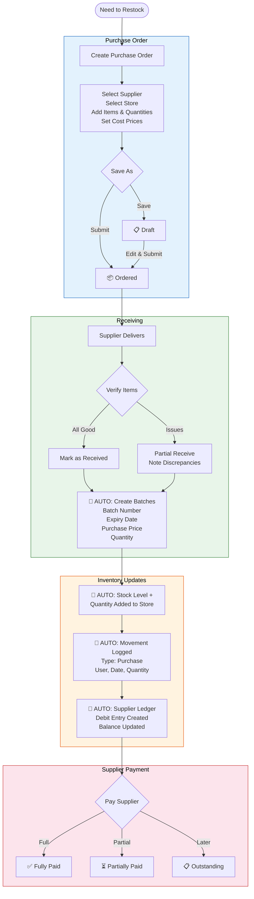

---

## 5. Inventory Management Flow

> **How stock moves through the system**

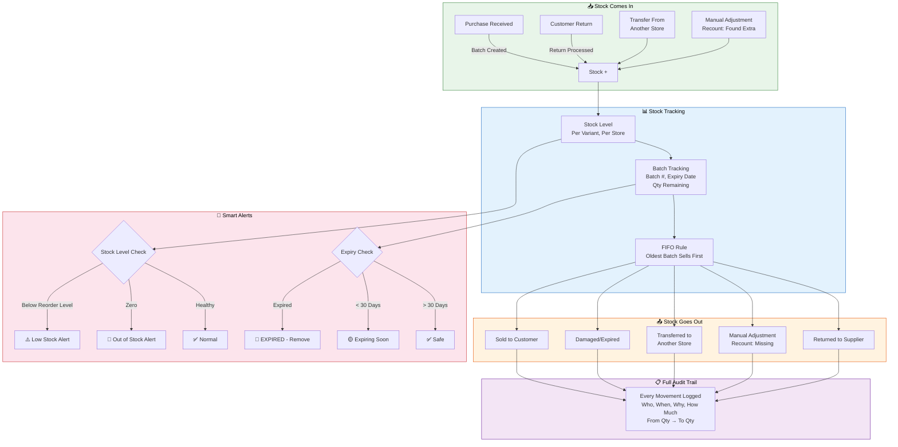

---

## 6. Point of Sale (POS) Flow

> **The moment of truth — selling to customers**

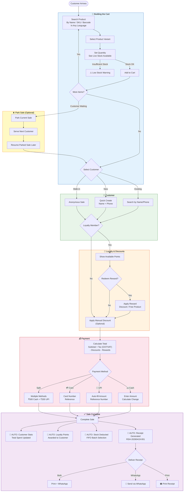

---

## 7. Customer & Loyalty Flow

> **Building lasting customer relationships**

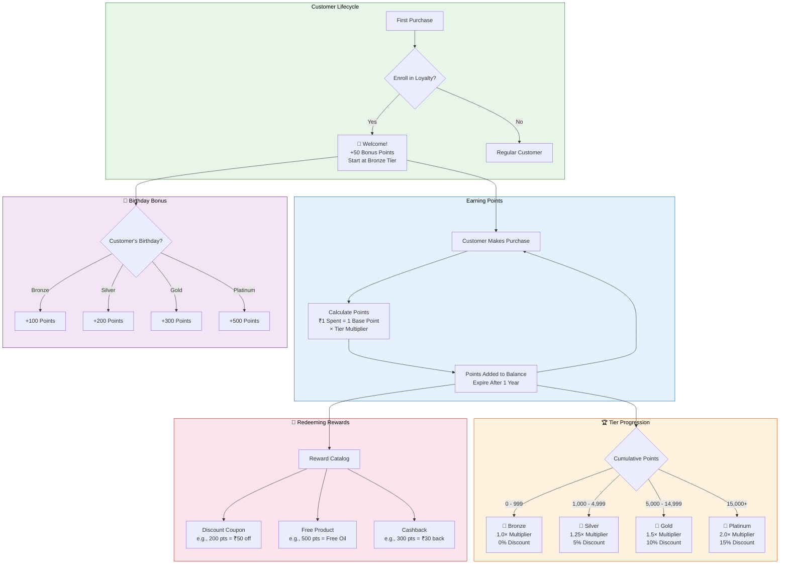

---

## 8. Supplier & Payment Flow

> **Managing supplier relationships and payments**

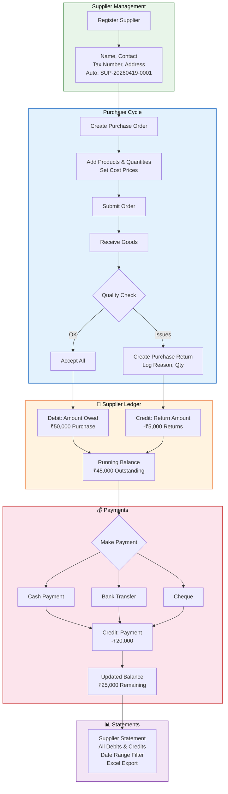

---

## 9. Reporting & Analytics Flow

> **Turning data into business decisions**

```mermaid
flowchart TD
    subgraph DATA_SOURCES["📊 Data Sources"]
        SALES[Every Sale]
        INVENTORY[Stock Levels]
        CUSTOMERS[Customer Activity]
        PURCHASES[Purchase History]
        CASHIERS[Cashier Activity]
    end

    subgraph REPORTS["📈 Available Reports"]
        SALES --> SR["Sales Report<br/>Daily/Weekly/Monthly<br/>By Store, Payment Method<br/>Top Products"]
        SALES & PURCHASES --> PR["Profit Report<br/>Revenue vs Cost<br/>Margin by Category<br/>Top/Bottom Products"]
        INVENTORY --> IR["Inventory Report<br/>ABC Analysis<br/>Turnover Rate<br/>Dead Stock Detection"]
        INVENTORY --> SVR["Stock Valuation<br/>Total Inventory Worth<br/>By Category/Supplier"]
        CUSTOMERS --> CR["Customer Analytics<br/>Lifetime Value<br/>RFM Segmentation<br/>9 Customer Segments"]
        CASHIERS --> CPR["Cashier Performance<br/>Efficiency Score<br/>Revenue per Hour<br/>Variance Analysis"]
        PURCHASES --> SLR["Supplier Ledger<br/>Outstanding Amounts<br/>Payment History"]
        CUSTOMERS --> CLR["Customer Ledger<br/>Receivables<br/>Payment Tracking"]
    end

    subgraph DELIVERY["📬 Report Delivery"]
        SR & PR & IR & SVR & CR & CPR & SLR & CLR --> VIEW["View on Screen"]
        SR & PR & IR & SVR & CR & CPR & SLR & CLR --> EXPORT["Export to Excel"]
        SR & PR & IR & SVR & CR & CPR & SLR & CLR --> SCHEDULE["Schedule Auto-Send<br/>Daily/Weekly/Monthly<br/>Email to Team"]
    end

    subgraph ALERTS["🚨 Smart Alerts"]
        INVENTORY --> A1["Low Stock Alert<br/>Below Reorder Level"]
        SALES --> A2["High-Value Sale Alert<br/>Above Threshold"]
        CASHIERS --> A3["Cashier Variance Alert<br/>Unusual Activity"]
        INVENTORY --> A4["Inventory Discrepancy<br/>Mismatch Detected"]
        SALES --> A5["Sales Target Alert<br/>Goal Reached/Missed"]
    end

    style DATA_SOURCES fill:#e8f5e9,stroke:#2e7d32,color:#000
    style REPORTS fill:#e3f2fd,stroke:#1565c0,color:#000
    style DELIVERY fill:#fff3e0,stroke:#e65100,color:#000
    style ALERTS fill:#fce4ec,stroke:#c62828,color:#000
```

---

## 10. Multi-Store Operations Flow

> **Managing multiple stores from one dashboard**

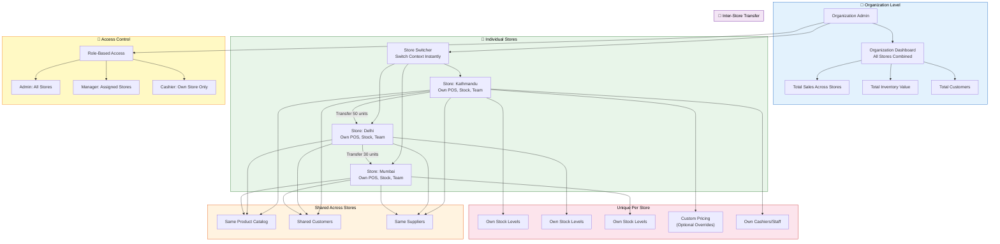

---

## 11. B2B / Wholesale Flow

> **Serving retail partners and bulk orders**

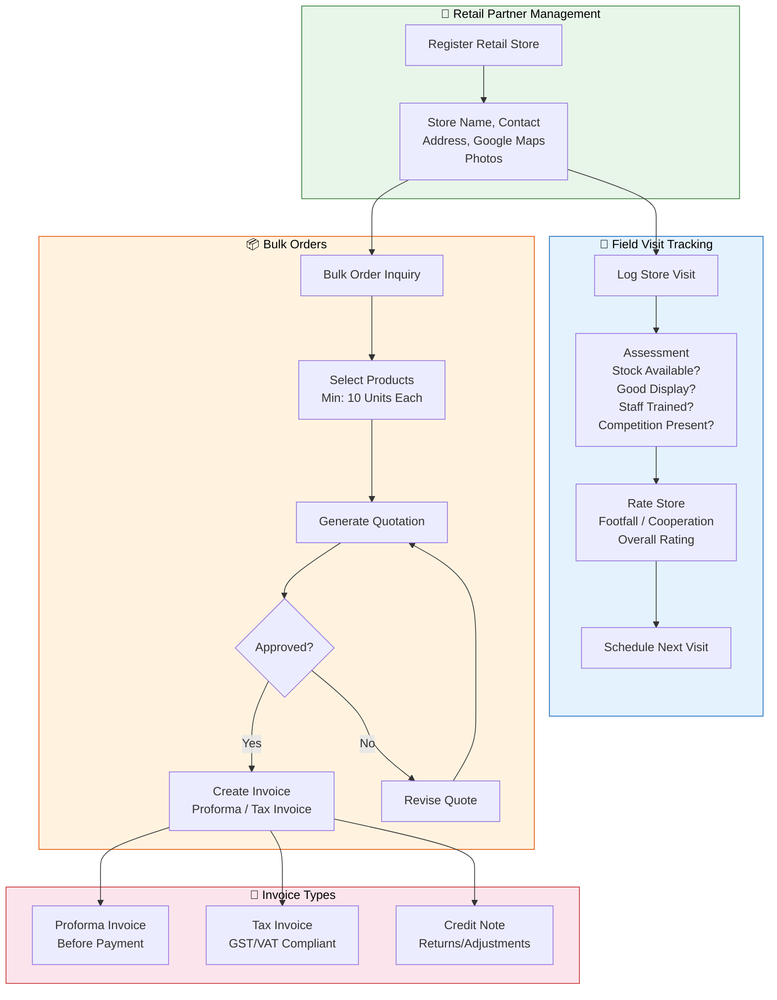

---

## 12. Complete Business Lifecycle

> **The big picture: how everything connects**

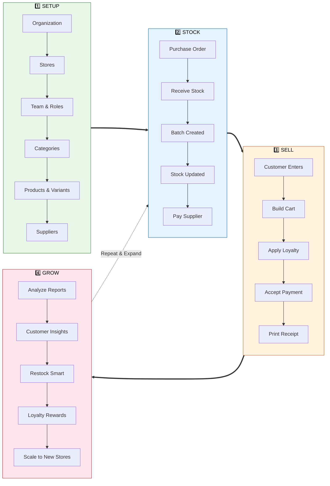

---

## Pricing Flow (India vs Nepal)

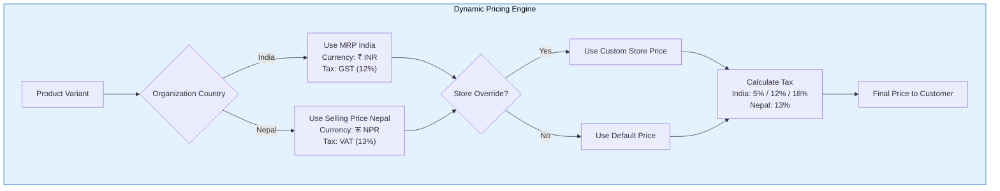

---

*These flowcharts can be rendered in any Mermaid-compatible viewer including GitHub, VS Code, and presentation tools.*
